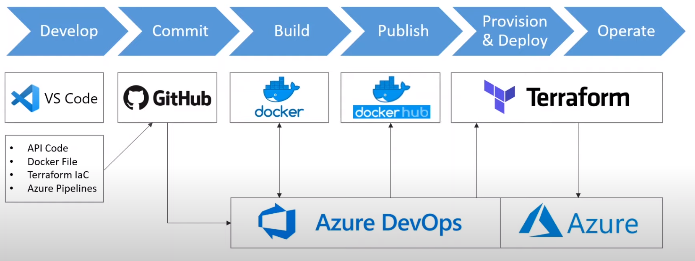
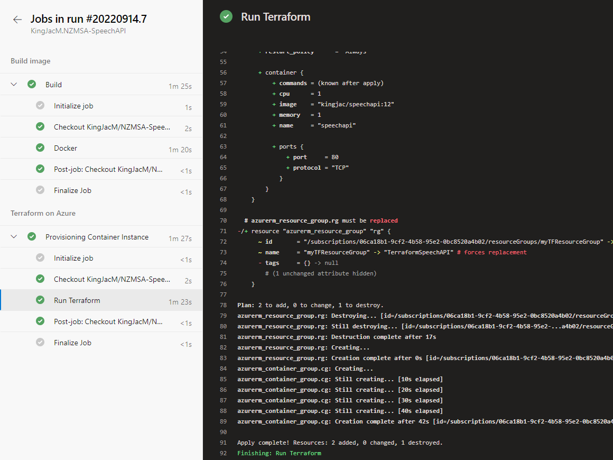
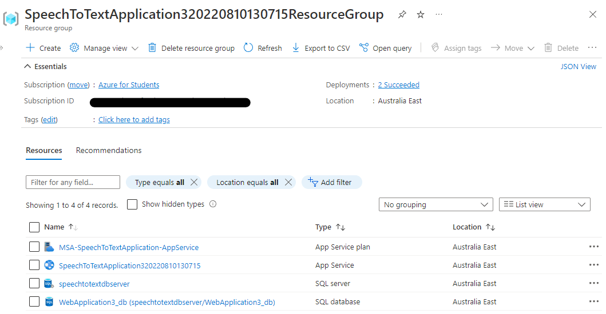
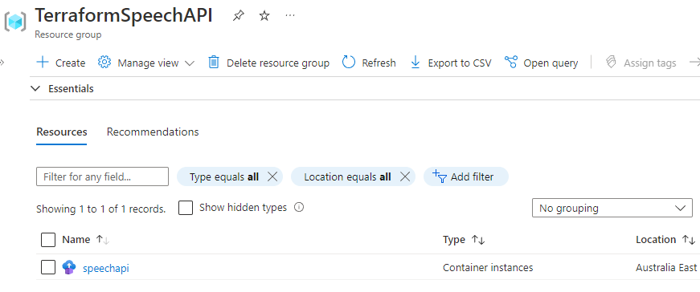

# MSA-Phase-3 Speech API

This is an audio-to-text transcribe API, powered by Google Cloud Speech .NET Library.

Try out live: https://speechtotextapplication320220810130715.azurewebsites.net/swagger/index.html

# 1. Features
In Phase 3, a YAML CI/CD pipeline is used to build and deploy API and  MySQL database to Azure App Service/Azure SQL.

Further, a containerised version of API is built and used Terraform to structure and provision a cloud environment, which is incorporated into a Azure DevOps CI/CD pipeline with Docker involved.

> source: https://www.youtube.com/watch?v=Ff0DoAmpv6w

(Azure DevOps pipeline)

(App Service)

(Containerised API using Terraform)

# 2. Notes

During the progress, a few non-technical problems regarding cloud account usage was occurred, including disabled Google Cloud json key and Azure DevOps policy changes for free tier users, therefore requested for late submission.
